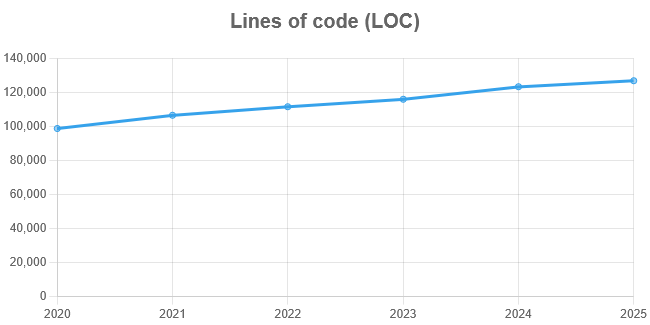
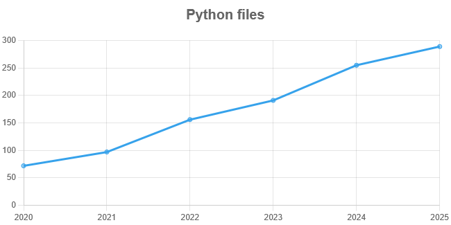
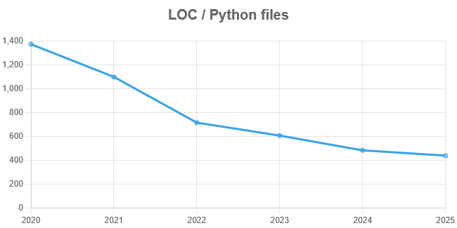
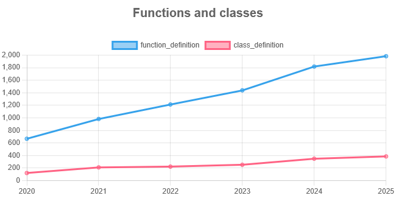
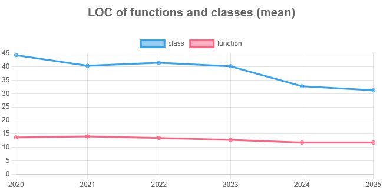
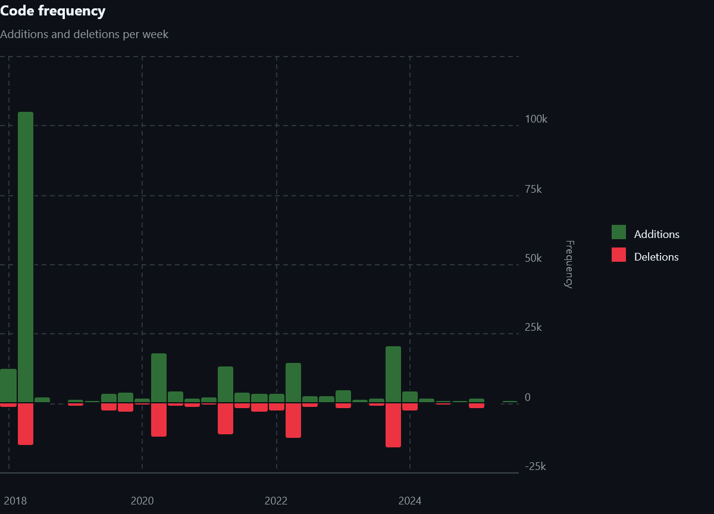
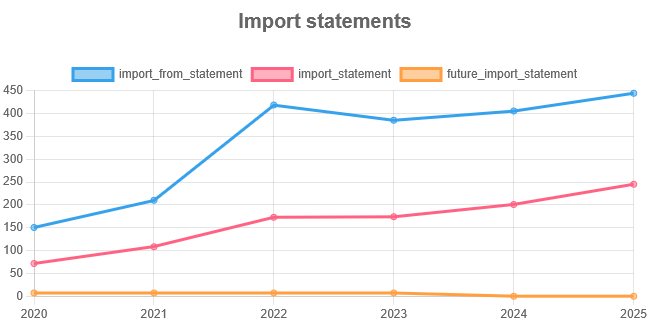

# Explorando evolução de código

Neste exercício, iremos explorar a evolução de código em sistemas reais.

Iremos utilizar a ferramenta [GitEvo](https://github.com/andrehora/gitevo).
Essa ferramenta analisa a evolução de código em repositórios Git nas linguagens Python, JavaScript, TypeScript e Java, e gera relatórios `HTML` como [este](https://andrehora.github.io/gitevo-examples/python/pandas.html).

Mais exemplos de relatórios podem ser podem ser encontrados em https://github.com/andrehora/gitevo-examples.

# Passo 1: Selecionar repositório a ser analisado

Selecione um repositório relevante na linguagem de sua preferência (Python, JavaScript, TypeScript ou Java).
Você pode encontrar projetos interessantes nos links abaixo:

- Python: https://github.com/topics/python?l=python
- JavaScript: https://github.com/topics/javascript?l=javascript
- TypeScript: https://github.com/topics/typescript?l=typescript
- Java: https://github.com/topics/java?l=java

# Passo 2: Instalar e rodar a ferramenta GitEvo

> [!NOTE]
> Antes de instalar a ferramenta, é recomendado criar e ativar um [ambiente virtual Python](https://packaging.python.org/en/latest/guides/installing-using-pip-and-virtual-environments/#create-and-use-virtual-environments).

Instale a ferramenta [GitEvo](https://github.com/andrehora/gitevo) com o comando:

```
$ pip install gitevo
```

Execute a ferramenta no repositório selecionado utilizando o comando abaixo (ajuste conforme a linguagem do repositório).
Substitua `<git_url>` pela URL do repositório que será analisado:

```shell
# Python
$ gitevo -r python <git_url>

# JavaScript
$ gitevo -r javascript <git_url>

# TypeScript
$ gitevo -r typescript <git_url>

# Java
$ gitevo -r java <git_url>
```

Por exemplo, para analisar o projeto Flask escrito em Python:

```
$ gitevo -r python https://github.com/pallets/flask
```

> [!NOTE]
> Essa etapa pode demorar alguns minutos pois o projeto será clonado e analisado localmente.

# Passo 3: Explorar o relatório de evolução de código

Após executar a ferramenta [GitEvo](https://github.com/andrehora/gitevo), é gerado um relatório `HTML` contendo diversos gráficos sobre a evolução do código.

Abra o relatório `HTML` e observe com atenção os gráficos.

# Passo 4: Explicar um gráfico de evolução de código

Selecione um dos gráficos de evolução e explique-o com suas palavras.
Por exemplo, você pode:

- Detalhar a evolução ao longo do tempo
- Detalhar se as curvas estão de acordo com boas práticas
- Explicar grandes alterações nas curvas
- Explorar a documentação do repositório em busca de explicações para grandes alterações
- etc.

Seja criativo!

# Instruções para o exercício

1. Crie um `fork` deste repositório (mais informações sobre forks [aqui](https://docs.github.com/pt/pull-requests/collaborating-with-pull-requests/working-with-forks/fork-a-repo)).
2. Adicione o relatório `HTML` no seu fork.
3. No Moodle, submeta apenas a URL do seu `fork`.

Responda às questões abaixo diretamente neste arquivo `README.md` do seu fork:

1. **Repositório selecionado:** https://github.com/psf/black
2. **Gráficos e explicações:**

    Lines of Code (LOC)        |Python Files               |LOC/Files
    :-------------------------:|:-------------------------:|:-------------------------:
         | |

    "Black" consiste em uma ferramenta para formatação de código Python. A ideia proposta por ela é o estabelecimento de um padrão claro, mesmo que opinativo, que elimine as preocupações associadas a tal tarefa, deixando mais tempo para o desenvolvedor focar no desenvolvimento em si. Os gráficos selecionados acima, obtidos a partir da ferramenta GitEvo sobre o repositório no GitHub do Black, apresentam, respectivamente, a evolução ao longo dos anos da quantidade total de linhas de código, da quantidade total de arquivos e da média de linhas de código por arquivo. A partir deles, é possível observar que o código em si não aumentou tanto, sendo 30% maior em 2025 em comparação a 2020. Por outro lado, a quantidade total de arquivos quadruplicou (aumento de 300%) e, naturalmente, a quantidade de código por arquivo também foi sendo reduzida. Essas características são um potencial indicativo de que houve esforços por parte dos desenvolvedores do Black em modularizar o repositório como um todo, quebrando estruturas longas e complexas, possivelmente condensadas em apenas um arquivo, em uma quantidade maior de módulos. Alguns benefícios associados a esse processo são o aumento da coesão de cada arquivo, o qual deve conter pouco código referente a apenas uma tarefa específica, e também uma facilitação da compreensão de seu conteúdo, o qual é menor e mais simples. Um exemplo que corrobora essa interpretação pode ser observado neste [commit](https://github.com/psf/black/pull/2206), em que uma refatoração de quebra de um arquivo em vários outros é descrita.
    
    Um comportamento similar foi observado no escopo de funções. Sua quantidade aumentou significativamente ao longo dos anos, enquanto a quantidade de linhas de código por função reduziu, indicando esforços no sentido de reduzir sua complexidade e de aumentar sua modularização, além, claro, do natural incremento de funcionalidades na ferramenta. Em outras palavras, possivelmente foram feitas muitas refatorações do tipo "extração de funções". Isso pode ser visto nos dois gráficos a seguir.

    Quantity of Functions                  | LOC per Function
    :-------------------------------------:|:-----------------------------------------:
         |

    A fim de se verificar um pouco mais a fundo as características apresentadas, foi extraído o gráfico da frequência de código (quantidade de adições e de remoções, por mês) diretamente do repositório do Black, o qual é apresentado a seguir.

    

    Uma observação interessante é que parece que uma grande atualização é feita em um determinado mês de todo o ano. Isso é confirmado na documentação da ferramenta, na qual, de fato, uma major release é registrada anualmente. Além disso, é possível ver como a quantidade de adições e de remoções parece ter sido bem homogênea no período analisado pelo GitEvo (2020-2025), corroborando o fato de que a quantidade total de linhas de código não aumentou muito.

    Pensando em anomalias observadas nos gráficos obtidos, o único comportamento que se destaca reside no gráfico abaixo, o qual indica a quantidade de cláusulas de importação no código.

    

    A razão para esse pico na quantidade de cláusulas de importação do tipo "from <> import <>" no ano de 2022 foi investigada, porém não se chegou a nenhuma conclusão definitiva. Dentre as informações encontradas, destaca-se que a primeira versão oficial do Black foi lançada em 2022 (as versões anteriores eram betas), mas, pela falta de impacto nos demais gráficos e considerando que tal evento deveria ter repercussões em todas as partes do código, não se tirou nenhuma conclusão. Explorando os commits no repositório, foi identificado que, em 2022, foi adicionado suporte para notebooks Jupyter, o que envolveu a adição de várias cláusulas de import. Novamente, a evidência é pouca para se dizer que essa foi a causa, mas talvez tenha contribuído de alguma forma.